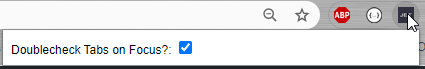
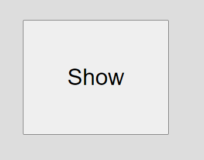
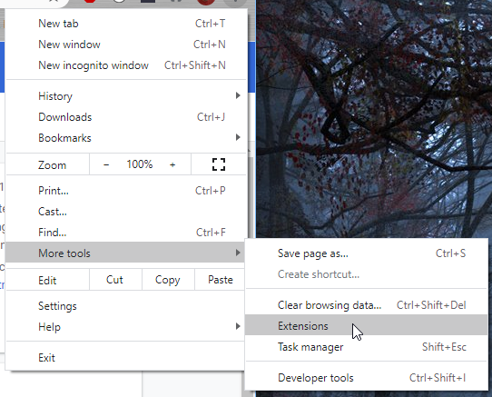
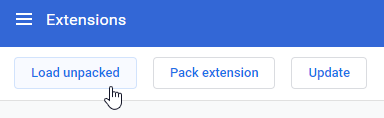
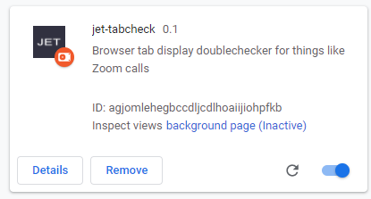

# jet-tabcheck

Chrome Extension to keep you aware of tabs you're opening when on Zoom or whatever. 

## Usage

Once installed, this plugin will just cause all new tabs to have a large message that says "Privacy Extension Active". You can then visit any page you want as usual. In the future, I'd like to add features to manage a custom homepage view that appears when this plugin is active, but for now it suffices to give you a quick visual queue to remind you that you're currently browsing in a shared view.

There's is an additional option that is turned off by default. If you click the icon in the upper right of the browser, you'll see a popup menu with a checkbox to "Doublecheck Tabs on Focus".

When this option is selected, then when you visit a new page, it'll first display a box to "Show Page" whenever you focus on a new tab. That way JUST in case you have something private or awkward up, it'll doublecheck that you meant to display that page. (This option is turned OFF when first installed.)

## Installation

This is not available on Chrome store yet, but you can install it manually following the instructions below.

1. Download this repository.

2. Open Chrome and go to your Extension setting:
   Settings (the three dots in upper right)

      

3. Click "Load Unpacked"

4. In the file selector, go into the folder you've downloaded and click "Select Folder"

5. Once installed, you should see a panel that looks like this in your Extensions page:

